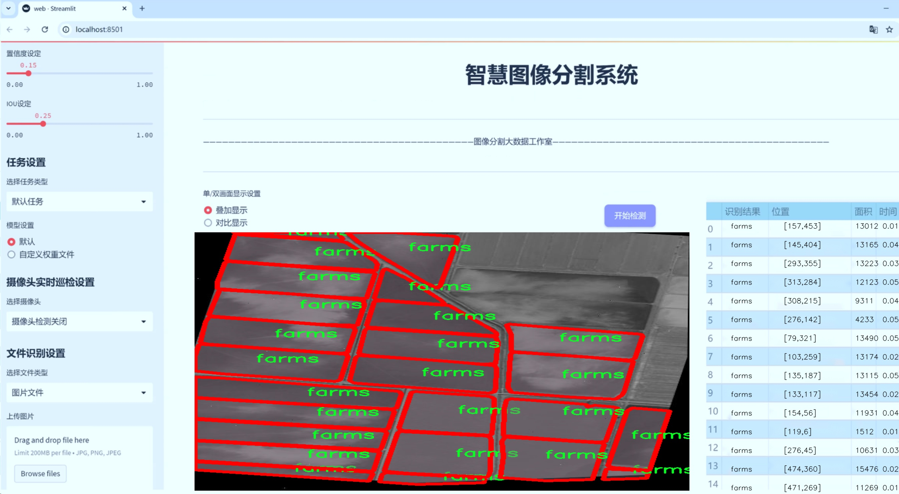
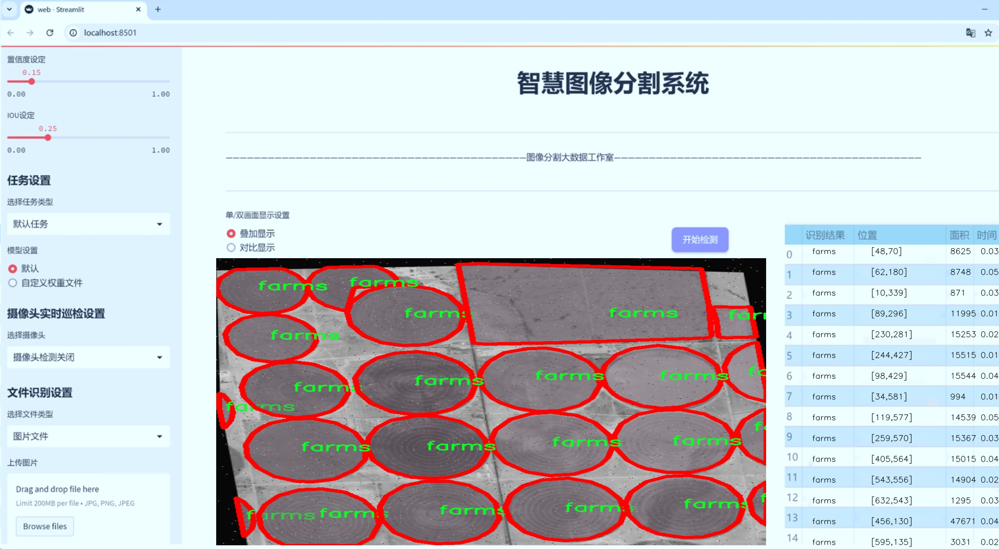
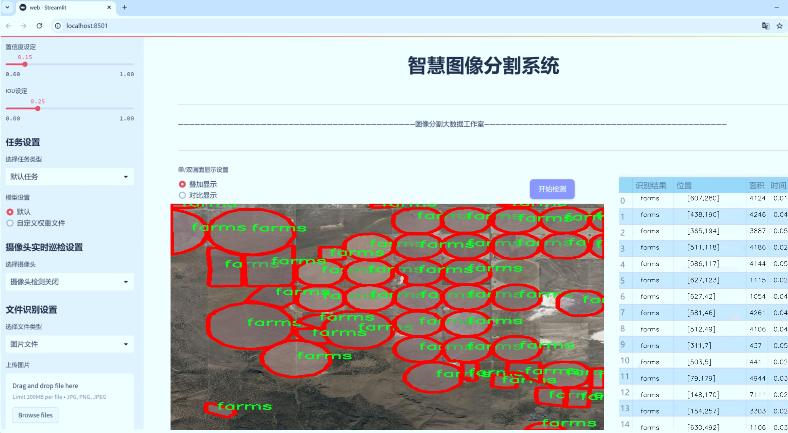
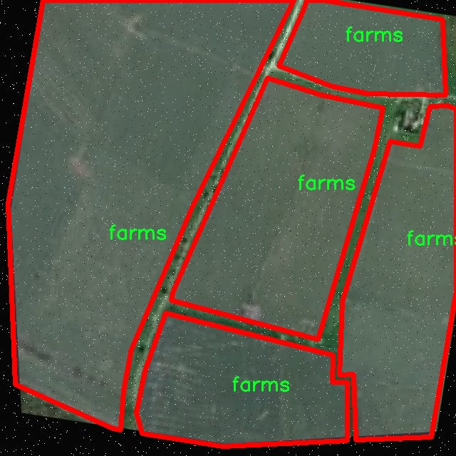
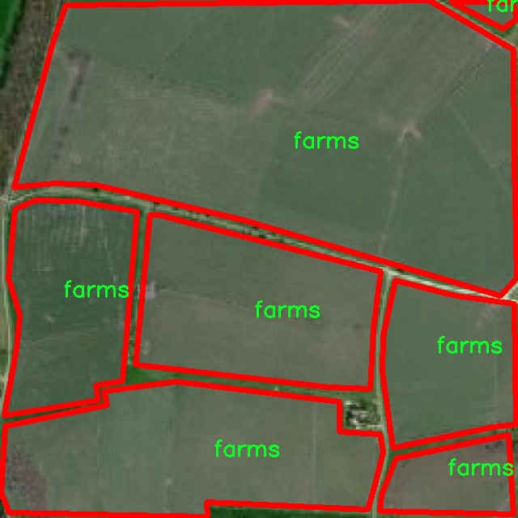
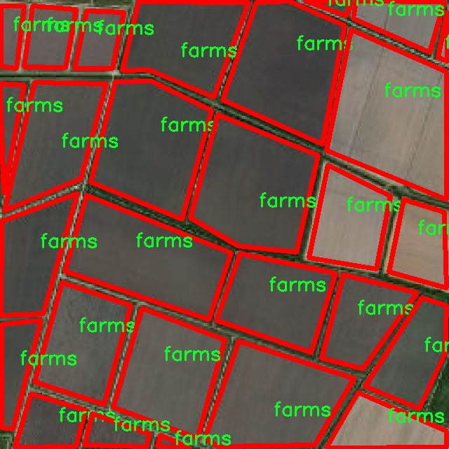
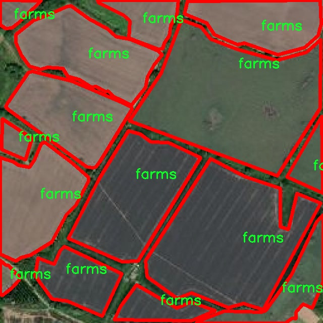
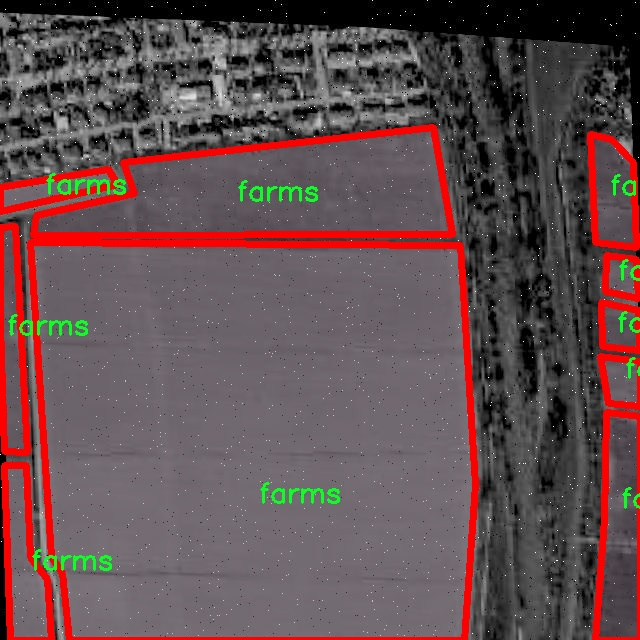

# 航拍农田分块图像分割系统： yolov8-seg-C2f-DCNV3

### 1.研究背景与意义

[参考博客](https://gitee.com/YOLOv8_YOLOv11_Segmentation_Studio/projects)

[博客来源](https://kdocs.cn/l/cszuIiCKVNis)

研究背景与意义

随着全球人口的不断增长和城市化进程的加快，农业生产面临着前所未有的挑战。如何提高农业生产效率、实现精准农业，成为了现代农业研究的重要课题。航拍技术的快速发展为农业监测和管理提供了新的视角和手段。通过无人机搭载高分辨率摄像头进行航拍，可以获取大范围农田的高质量图像，这为后续的图像处理和分析提供了丰富的数据基础。然而，如何从这些复杂的图像中提取出有用的信息，尤其是进行农田的分块和作物分类，仍然是一个亟待解决的问题。

在这一背景下，图像分割技术的应用显得尤为重要。传统的图像分割方法往往依赖于手工特征提取，难以适应复杂多变的农田环境。而深度学习技术的兴起，尤其是YOLO（You Only Look Once）系列模型的不断演进，为图像分割提供了新的解决方案。YOLOv8作为该系列的最新版本，具备了更高的准确性和实时性，能够在复杂的场景中实现快速、准确的目标检测和分割。基于YOLOv8的航拍农田分块图像分割系统，能够有效地识别和分割不同作物区域，为农田管理提供精准的数据支持。

本研究旨在基于改进的YOLOv8模型，构建一个高效的航拍农田分块图像分割系统。我们将利用Cleaned Detectron 2数据集中的7600幅图像，进行实例分割任务。该数据集包含了两类农田图像，能够为模型的训练和验证提供丰富的样本。通过对YOLOv8模型的改进，我们将重点关注模型在农田图像分割中的表现，探索如何通过优化网络结构、调整超参数以及引入数据增强技术，提升模型的分割精度和鲁棒性。

本研究的意义不仅在于推动图像分割技术在农业领域的应用，更在于为精准农业的实现提供理论和实践支持。通过对农田进行精细化管理，农民可以更好地掌握作物生长状况，及时调整管理措施，从而提高作物产量和质量。此外，基于航拍数据的农田分块系统，还能够为农业政策的制定和实施提供科学依据，促进可持续农业的发展。

综上所述，基于改进YOLOv8的航拍农田分块图像分割系统的研究，不仅具有重要的学术价值，也具有广泛的应用前景。通过本研究，我们希望能够为农业现代化进程贡献一份力量，推动农业科技的进步，实现农业生产的智能化和精准化。

### 2.图片演示







注意：本项目提供完整的训练源码数据集和训练教程,由于此博客编辑较早,暂不提供权重文件（best.pt）,需要按照6.训练教程进行训练后实现上图效果。

### 3.视频演示

[3.1 视频演示](https://www.bilibili.com/video/BV1zXByYfE9w/)

### 4.数据集信息

##### 4.1 数据集类别数＆类别名

nc: 2
names: ['84 - v2 2024-06-26 12-32pm', 'farms']


##### 4.2 数据集信息简介

数据集信息展示

在本研究中，我们使用了名为“Cleaned Detectron 2”的数据集，以支持对航拍农田进行分块图像分割的任务。该数据集经过精心清理和标注，旨在为改进YOLOv8-seg模型提供高质量的训练样本，从而提升其在农业遥感领域的应用效果。数据集的设计考虑到了农田分块的复杂性和多样性，确保能够涵盖不同类型的农田特征，以便模型能够学习到有效的分割策略。

“Cleaned Detectron 2”数据集包含两个主要类别，分别为“84 - v2 2024-06-26 12-32pm”和“farms”。第一个类别代表特定的农田样本，可能涉及某种特定作物或地块的特征，这些样本是在特定时间和条件下采集的，能够反映出农田在不同生长阶段的状态。通过对这一类别的分析，模型可以学习到不同作物在生长过程中的视觉特征，从而提高其在实际应用中的识别能力。

第二个类别“farms”则更为广泛，涵盖了多种类型的农田图像。这一类别的样本可能包括不同的地块布局、作物种类以及农田管理方式等信息，提供了丰富的背景数据，帮助模型理解不同农田的结构和特征。通过将这两个类别结合，数据集不仅能够支持模型在特定条件下的表现，还能提升其在多样化场景中的适应能力。

在数据集的构建过程中，标注团队采用了高标准的标注流程，确保每个图像的分割区域准确无误。这种高质量的标注对于训练深度学习模型至关重要，因为模型的性能往往依赖于输入数据的质量。通过使用“Cleaned Detectron 2”数据集，我们能够有效地训练YOLOv8-seg模型，使其在农田分块图像分割任务中表现出色。

此外，数据集的设计还考虑到了数据的多样性和代表性。为了确保模型的泛化能力，数据集中包含了来自不同地理区域和气候条件下的农田图像。这种多样性使得模型能够在面对不同的环境和条件时，依然保持较高的分割精度，从而在实际应用中具备更强的实用性。

总之，“Cleaned Detectron 2”数据集为本研究提供了一个坚实的基础，使得我们能够在航拍农田分块图像分割领域进行深入探索。通过对该数据集的充分利用，我们期望能够改进YOLOv8-seg模型的性能，推动农业遥感技术的发展，为精准农业和可持续发展提供有力支持。数据集的结构和内容为模型的训练提供了丰富的资源，确保了研究的顺利进行和成果的有效转化。











### 5.项目依赖环境部署教程（零基础手把手教学）

[5.1 环境部署教程链接（零基础手把手教学）](https://www.bilibili.com/video/BV1jG4Ve4E9t/?vd_source=bc9aec86d164b67a7004b996143742dc)


[5.2 安装Python虚拟环境创建和依赖库安装视频教程链接（零基础手把手教学）](https://www.bilibili.com/video/BV1nA4VeYEze/?vd_source=bc9aec86d164b67a7004b996143742dc)

### 6.手把手YOLOV8-seg训练视频教程（零基础手把手教学）

[6.1 手把手YOLOV8-seg训练视频教程（零基础小白有手就能学会）](https://www.bilibili.com/video/BV1cA4VeYETe/?vd_source=bc9aec86d164b67a7004b996143742dc)


按照上面的训练视频教程链接加载项目提供的数据集，运行train.py即可开始训练



     Epoch   gpu_mem       box       obj       cls    labels  img_size
     1/200     0G   0.01576   0.01955  0.007536        22      1280: 100%|██████████| 849/849 [14:42<00:00,  1.04s/it]
               Class     Images     Labels          P          R     mAP@.5 mAP@.5:.95: 100%|██████████| 213/213 [01:14<00:00,  2.87it/s]
                 all       3395      17314      0.994      0.957      0.0957      0.0843

     Epoch   gpu_mem       box       obj       cls    labels  img_size
     2/200     0G   0.01578   0.01923  0.007006        22      1280: 100%|██████████| 849/849 [14:44<00:00,  1.04s/it]
               Class     Images     Labels          P          R     mAP@.5 mAP@.5:.95: 100%|██████████| 213/213 [01:12<00:00,  2.95it/s]
                 all       3395      17314      0.996      0.956      0.0957      0.0845

     Epoch   gpu_mem       box       obj       cls    labels  img_size
     3/200     0G   0.01561    0.0191  0.006895        27      1280: 100%|██████████| 849/849 [10:56<00:00,  1.29it/s]
               Class     Images     Labels          P          R     mAP@.5 mAP@.5:.95: 100%|███████   | 187/213 [00:52<00:00,  4.04it/s]
                 all       3395      17314      0.996      0.957      0.0957      0.0845


### 7.50+种全套YOLOV8-seg创新点加载调参实验视频教程（一键加载写好的改进模型的配置文件）

[7.1 50+种全套YOLOV8-seg创新点加载调参实验视频教程（一键加载写好的改进模型的配置文件）](https://www.bilibili.com/video/BV1Hw4VePEXv/?vd_source=bc9aec86d164b67a7004b996143742dc)

### YOLOV8-seg算法简介

原始YOLOV8-seg算法原理

YOLOv8-seg是YOLO系列中最新的目标检测与图像分割算法，基于YOLOv8的架构，结合了目标检测和语义分割的优势，旨在提供更高效、更精确的图像分析能力。YOLOv8的设计理念是快速、准确且易于使用，适用于多种应用场景，如自动驾驶、安防监控和医疗影像分析等。与其前身YOLOv5相比，YOLOv8在检测精度和速度上都有显著提升，尤其是在处理复杂场景和多尺度目标时，表现得尤为出色。

YOLOv8的网络结构可以分为四个主要部分：输入端、骨干网络、颈部网络和头部网络。输入端负责图像的预处理，包括马赛克数据增强、自适应锚框计算和自适应灰度填充等。马赛克增强通过将多张图像拼接在一起，生成新的训练样本，增加了模型对不同场景的适应能力。自适应锚框计算则根据输入图像的特征动态生成锚框，提升了目标检测的灵活性和准确性。

在骨干网络部分，YOLOv8采用了C2f模块和SPPF（Spatial Pyramid Pooling Fusion）结构。C2f模块通过引入更多的分支和跨层连接，增强了梯度流的丰富性，从而提高了特征表示能力。这一设计灵感来源于YOLOv7的ELAN结构，使得YOLOv8在特征提取方面具备了更强的能力，能够更好地捕捉图像中的细节信息。SPPF结构则通过多尺度特征融合，进一步提升了模型对不同尺度目标的检测能力。

颈部网络采用了路径聚合网络（PAN）结构，旨在加强不同尺度特征的融合。PAN通过将来自不同层次的特征进行聚合，使得模型在处理多尺度目标时能够有效地整合信息，提升检测的精度和鲁棒性。这一设计使得YOLOv8在面对复杂场景时，能够更好地识别和分割目标，尤其是在目标尺寸差异较大的情况下。

头部网络是YOLOv8中变化最大的部分。与以往的耦合头结构不同，YOLOv8采用了解耦头结构，将分类和检测过程分开进行。这一设计不仅提高了模型的灵活性，还简化了损失计算过程。在分类分支中，YOLOv8使用了二元交叉熵损失（BCELoss），而在边界框回归分支中，则结合了分布焦点损失（DFLoss）和完全交并比损失（CIOULoss），以提升模型对边界框预测的精准性。通过这种方式，YOLOv8能够更快速地聚焦于目标附近的区域，提高了检测的准确性。

值得注意的是，YOLOv8在头部网络中摒弃了传统的基于锚框的检测方法，转而采用无锚框（Anchor-Free）检测策略。这一创新使得YOLOv8能够更灵活地处理不同形状和大小的目标，避免了传统锚框方法在处理复杂场景时的局限性。无锚框检测将目标检测转化为关键点检测，简化了模型的设计，提高了计算效率，同时增强了模型的泛化能力。

在YOLOv8-seg的实现中，图像分割的过程与目标检测相辅相成。通过在头部网络中引入分割分支，YOLOv8-seg能够在检测目标的同时，对目标进行精确的像素级分割。这一特性使得YOLOv8-seg在需要高精度分割的应用场景中表现尤为突出，如医学影像分析和自动驾驶等领域。

总的来说，YOLOv8-seg算法通过引入新的网络结构和无锚框检测策略，极大地提升了目标检测和图像分割的性能。其高效的设计和强大的特征提取能力，使得YOLOv8-seg成为当今图像分析领域的一项重要工具，能够满足多种复杂应用的需求。随着YOLOv8-seg的不断发展和优化，未来在目标检测和图像分割的应用中，将会展现出更广阔的前景和潜力。


### 9.系统功能展示（检测对象为举例，实际内容以本项目数据集为准）

图9.1.系统支持检测结果表格显示

  图9.2.系统支持置信度和IOU阈值手动调节

  图9.3.系统支持自定义加载权重文件best.pt(需要你通过步骤5中训练获得)

  图9.4.系统支持摄像头实时识别

  图9.5.系统支持图片识别

  图9.6.系统支持视频识别

  图9.7.系统支持识别结果文件自动保存

  图9.8.系统支持Excel导出检测结果数据


### 10.50+种全套YOLOV8-seg创新点原理讲解（非科班也可以轻松写刊发刊，V11版本正在科研待更新）

#### 10.1 由于篇幅限制，每个创新点的具体原理讲解就不一一展开，具体见下列网址中的创新点对应子项目的技术原理博客网址【Blog】：


[10.1 50+种全套YOLOV8-seg创新点原理讲解链接](https://gitee.com/qunmasj/good)

#### 10.2 部分改进模块原理讲解(完整的改进原理见上图和技术博客链接)【如果此小节的图加载失败可以通过CSDN或者Github搜索该博客的标题访问原始博客，原始博客图片显示正常】
### 深度学习基础
卷积神经网络通过使用具有共享参数的卷积运算显著降低了模型的计算开销和复杂性。在LeNet、AlexNet和VGG等经典网络的驱动下，卷积神经网络现在已经建立了一个完整的系统，并在深度学习领域形成了先进的卷积神经网络模型。

感受野注意力卷积RFCBAMConv的作者在仔细研究了卷积运算之后获得了灵感。对于分类、目标检测和语义分割任务，一方面，图像中不同位置的对象的形状、大小、颜色和分布是可变的。在卷积操作期间，卷积核在每个感受野中使用相同的参数来提取信息，而不考虑来自不同位置的差分信息。这限制了网络的性能，这已经在最近的许多工作中得到了证实。

另一方面，卷积运算没有考虑每个特征的重要性，这进一步影响了提取特征的有效性，并最终限制了模型的性能。此外，注意力机制允许模型专注于重要特征，这可以增强特征提取的优势和卷积神经网络捕获详细特征信息的能力。因此，注意力机制在深度学习中得到了广泛的应用，并成功地应用于各个领域。

通过研究卷积运算的内在缺陷和注意力机制的特点，作者认为现有的空间注意力机制从本质上解决了卷积运算的参数共享问题，但仍局限于对空间特征的认知。对于较大的卷积核，现有的空间注意力机制并没有完全解决共享参数的问题。此外，他们无法强调感受野中每个特征的重要性，例如现有的卷积块注意力模块（CBAM）和 Coordinate注意力（CA）。

因此，[参考该博客提出了一种新的感受野注意力机制（RFA）](https://qunmasj.com)，它完全解决了卷积核共享参数的问题，并充分考虑了感受野中每个特征的重要性。通过RFA设计的卷积运算（RFAConv）是一种新的卷积运算，可以取代现有神经网络中的标准卷积运算。RFAConv通过添加一些参数和计算开销来提高网络性能。

大量关于Imagnet-1k、MS COCO和VOC的实验已经证明了RFAConv的有效性。作为一种由注意力构建的新型卷积运算，它超过了由CAM、CBAM和CA构建的卷积运算（CAMConv、CBAMConv、CAConv）以及标准卷积运算。

此外，为了解决现有方法提取感受野特征速度慢的问题，提出了一种轻量级操作。在构建RFAConv的过程中，再次设计了CA和CBAM的升级版本，并进行了相关实验。作者认为当前的空间注意力机制应该将注意力放在感受野空间特征上，以促进当前空间注意力机制的发展，并再次增强卷积神经网络架构的优势。


### 卷积神经网络架构
出色的神经网络架构可以提高不同任务的性能。卷积运算作为卷积神经网络的一种基本运算，推动了人工智能的发展，并为车辆检测、无人机图像、医学等先进的网络模型做出了贡献。He等人认为随着网络深度的增加，该模型将变得难以训练并产生退化现象，因此他们提出了残差连接来创新卷积神经网络架构的设计。Huang等人通过重用特征来解决网络梯度消失问题，增强了特征信息，他们再次创新了卷积神经网络架构。

通过对卷积运算的详细研究，Dai等人认为，具有固定采样位置的卷积运算在一定程度上限制了网络的性能，因此提出了Deformable Conv，通过学习偏移来改变卷积核的采样位置。在Deformable Conv的基础上，再次提出了Deformable Conv V2和Deformable Conv V3，以提高卷积网络的性能。

Zhang等人注意到，组卷积可以减少模型的参数数量和计算开销。然而，少于组内信息的交互将影响最终的网络性能。1×1的卷积可以与信息相互作用。然而，这将带来更多的参数和计算开销，因此他们提出了无参数的“通道Shuffle”操作来与组之间的信息交互。

Ma等人通过实验得出结论，对于参数较少的模型，推理速度不一定更快，对于计算量较小的模型，推理也不一定更快。经过仔细研究提出了Shufflenet V2。

YOLO将输入图像划分为网格，以预测对象的位置和类别。经过不断的研究，已经提出了8个版本的基于YOLO的目标检测器，如YOLOv5、YOLOv7、YOLOv8等。上述卷积神经网络架构已经取得了巨大的成功。然而，它们并没有解决提取特征过程中的参数共享问题。本文的工作从注意力机制开始，从一个新的角度解决卷积参数共享问题。

### 注意力机制
注意力机制被用作一种提高网络模型性能的技术，使其能够专注于关键特性。注意力机制理论已经在深度学习中建立了一个完整而成熟的体系。Hu等人提出了一种Squeeze-and-Excitation（SE）块，通过压缩特征来聚合全局通道信息，从而获得与每个通道对应的权重。Wang等人认为，当SE与信息交互时，单个通道和权重之间的对应关系是间接的，因此设计了高效通道注Efficient Channel Attention力（ECA），并用自适应kernel大小的一维卷积取代了SE中的全连接（FC）层。Woo等人提出了卷积块注意力模块（CBAM），它结合了通道注意力和空间注意力。作为一个即插即用模块，它可以嵌入卷积神经网络中，以提高网络性能。

尽管SE和CBAM已经提高了网络的性能。Hou等人仍然发现压缩特征在SE和CBAM中丢失了太多信息。因此，他们提出了轻量级Coordinate注意力（CA）来解决SE和CBAM中的问题。Fu等人计了一个空间注意力模块和通道注意力模块，用于扩展全卷积网络（FCN），分别对空间维度和通道维度的语义相关性进行建模。Zhang等人在通道上生成不同尺度的特征图，以建立更有效的通道注意力机制。

本文从一个新的角度解决了标准卷积运算的参数共享问题。这就是将注意力机制结合起来构造卷积运算。尽管目前的注意力机制已经获得了良好的性能，但它们仍然没有关注感受野的空间特征。因此，设计了具有非共享参数的RFA卷积运算，以提高网络的性能。


#### 回顾标准卷积
以标准卷积运算为基础构建卷积神经网络，通过共享参数的滑动窗口提取特征信息，解决了全连接层构建的神经网络的固有问题（即参数数量大、计算开销高）。

设表示输入特征图，其中、和分别表示特征图的通道数、高度和宽度。为了能够清楚地展示卷积核提取特征信息的过程，以为例。提取每个感受野slider的特征信息的卷积运算可以表示如下：


这里，表示在每次卷积slider操作之后获得的值，表示在每个slider内的相应位置处的像素值。表示卷积核，表示卷积核中的参数数量，表示感受野slider的总数。

可以看出，每个slider内相同位置的特征共享相同的参数。因此，标准的卷积运算无法感知不同位置带来的差异信息，这在一定程度上限制了卷积神经网络的性能。

#### 回顾空间注意力
目前，空间注意力机制使用通过学习获得的注意力图来突出每个特征的重要性。与上一节类似，以为例。突出关键特征的空间注意力机制可以简单地表达如下：


这里，表示在加权运算之后获得的值。和分别表示输入特征图和学习注意力图在不同位置的值，是输入特征图的高度和宽度的乘积，表示像素值的总数。一般来说，整个过程可以简单地表示在图1中。


#### 空间注意力与标准卷积
众所周知，将注意力机制引入卷积神经网络可以提高网络的性能。通过标准的卷积运算和对现有空间注意力机制的仔细分析。作者认为空间注意力机制本质上解决了卷积神经网络的固有缺点，即共享参数的问题。

目前，该模型最常见的卷积核大小为1×1和3×3。引入空间注意力机制后用于提取特征的卷积操作是1×1或3×3卷积操作。这个过程可以直观地显示出来。空间注意力机制被插入到1×1卷积运算的前面。通过注意力图对输入特征图进行加权运算（Re-weight“×”），最后通过1×1卷积运算提取感受野的slider特征信息。

整个过程可以简单地表示如下：


 

这里，卷积核仅表示一个参数值。如果将的值作为一个新的卷积核参数，那么有趣的是，通过1×1卷积运算提取特征时的参数共享问题得到了解决。然而，空间注意力机制的传说到此结束。当空间注意力机制被插入到3×3卷积运算的前面时。具体情况如下：


如上所述，如果取的值。作为一种新的卷积核参数，上述方程完全解决了大规模卷积核的参数共享问题。然而，最重要的一点是，卷积核在每个感受野slider中提取将共享部分特征的特征。换句话说，在每个感受野slider内都会有重叠。

经过仔细分析发现，，…，空间注意力图的权重在每个slider内共享。因此，空间注意机制不能解决大规模卷积核共享参数的问题，因为它们不注意感受野的空间特征。在这种情况下，空间注意力机制是有限的。
#### 创新空间注意力与标准卷积
RFA是为了解决空间注意力机制问题而提出的，创新了空间注意力。使用与RFA相同的思想，一系列空间注意力机制可以再次提高性能。RFA设计的卷积运算可以被视为一种轻量级的即插即用模块，以取代标准卷积，从而提高卷积神经网络的性能。因此，作者认为空间注意力机制和标准卷积在未来将有一个新的春天。

感受野的空间特征：

现在给出感受野空间特征的定义。它是专门为卷积核设计的，并根据kernel大小动态生成，如图2所示，以3×3卷积核为例。


在图2中，“空间特征”表示原始特征图，等于空间特征。“感受野空间特征”表示变换后的特征，该特征由每个感受野slider滑块组成，并且不重叠。也就是说，“感受野空间特征”中的每个3×3大小的slider表示提取原始3×3卷积特征时所有感觉野slider的特征。

#### 感受野注意力卷积(RFA):

关于感受野空间特征，该博客的作者提出了感受野注意（RFA），它不仅强调了感受野slider内各种特征的重要性，而且还关注感受野空间特性，以彻底解决卷积核参数共享的问题。感受野空间特征是根据卷积核的大小动态生成的，因此，RFA是卷积的固定组合，不能脱离卷积运算的帮助，卷积运算同时依赖RFA来提高性能。

因此，作者提出了感受野注意力卷积（RFAConv）。具有3×3大小卷积核的RFAConv的总体结构如图3所示。


目前，提取感受野特征最常用的方法速度较慢，因此经过不断探索提出了一种快速的方法，通过分组卷积来取代原来的方法。

具体来说，根据感受野大小，使用相应的组卷积大小来动态生成展开特征。尽管与原始的无参数方法（如Pytorch提供的nn.Unfld()）相比，该方法添加了一些参数，但速度要快得多。

注意：正如在上一节中提到的，当原始的3×3卷积核提取特征时，感受野空间特征中的每个3×3大小的窗口表示所有感受野滑块的特征。但在快速分组卷积提取感受野特征后，由于原始方法太慢，它们会被映射到新的特征中。

最近的一些工作已经证明信息交互可以提高网络性能。类似地，对于RFAConv，与感受野特征信息交互以学习注意力图可以提高网络性能，但与每个感受野特征交互将带来额外的计算开销。为了确保少量的计算开销和参数数量，通过探索使用AvgPool池化每个感受野特征的全局信息，然后通过1×1组卷积运算与信息交互。最后，softmax用于强调感受野特征中每个特征的重要性。通常，RFA的计算可以表示为：


表示分组卷积，表示卷积核的大小，代表规范化，表示输入特征图，是通过将注意力图与变换的感受野空间特征相乘而获得的。

与CBAM和CA不同，RFA可以为每个感受野特征生成注意力图。标准卷积受到卷积神经网络性能的限制，因为共享参数的卷积运算对位置带来的差异信息不敏感。RFA完全可以解决这个问题，具体细节如下：


由于RFA获得的特征图是“调整形状”后不重叠的感受野空间特征，因此通过池化每个感受野滑块的特征信息来学习学习的注意力图。换句话说，RFA学习的注意力图不再在每个感受野slider内共享，并且是有效的。这完全解决了现有的CA和CBAM对大尺寸kernel的注意力机制中的参数共享问题。

同时，RFA给标准卷积核带来了相当大的好处，但调整形状后，特征的高度和宽度是k倍，需要进行k×k的stride卷积运算，才能提取特征信息。RFAConv创新了标准卷积运算。

此外，空间注意力机制将得到升级，因为作者认为现有的空间注意力机制应该专注于感受野空间特征，以提高网络的性能。众所周知，基于自注意力机制的网络模型取得了巨大的成功，因为它解决了卷积参数共享的问题，并对远程信息进行了建模，但基于自注意力机理的方法给模型带来了巨大的计算开销和复杂性。作者认为通过将一些现有空间注意力机制的注意力放在感受野空间特征中，它以轻量级的方式解决了自注意力机制的问题。

答案如下：

将关注感受野空间特征的空间注意力与卷积相匹配，完全解决了卷积参数共享的问题；

当前的空间注意力机制本身具有考虑远距离信息的特点，它们通过全局平均池化或全局最大池化来获得全局信息，这在一定程度上考虑了远距离信息。


为此，作者设计了一种新的CBAM和CA，称为RFACBAM和RFACA，它专注于感受野的空间特征。与RFA类似，使用stride为k的k×k的最终卷积运算来提取特征信息，具体结构如图4和图5所示，将这2种新的卷积方法称为RFCBAMConv和RFCAConv。比较原始的CBAM，使用SE注意力来代替RFCBAM中的CAM。因为这样可以减少计算开销。


此外，在RFCBAM中，通道和空间注意力不是在单独的步骤中执行的，因为通道和空间注意力是同时加权的，从而允许在每个通道上获得的注意力图是不同的。


### 11.项目核心源码讲解（再也不用担心看不懂代码逻辑）

#### 11.1 ultralytics\trackers\bot_sort.py

以下是对代码中最核心部分的分析和详细中文注释：

```python
# Ultralytics YOLO 🚀, AGPL-3.0 license

from collections import deque
import numpy as np
from .basetrack import TrackState
from .byte_tracker import BYTETracker, STrack
from .utils import matching
from .utils.gmc import GMC
from .utils.kalman_filter import KalmanFilterXYWH

class BOTrack(STrack):
    """
    BOTrack类是STrack类的扩展版本，添加了对象跟踪功能。
    """

    shared_kalman = KalmanFilterXYWH()  # 所有BOTrack实例共享的卡尔曼滤波器

    def __init__(self, tlwh, score, cls, feat=None, feat_history=50):
        """
        初始化BOTrack实例，设置边界框、得分、类别和特征历史。
        :param tlwh: 边界框的tlwh格式 (左上角x, 左上角y, 宽度, 高度)
        :param score: 检测得分
        :param cls: 类别
        :param feat: 特征向量
        :param feat_history: 特征历史的最大长度
        """
        super().__init__(tlwh, score, cls)  # 调用父类构造函数

        self.smooth_feat = None  # 平滑特征向量
        self.curr_feat = None  # 当前特征向量
        if feat is not None:
            self.update_features(feat)  # 更新特征
        self.features = deque([], maxlen=feat_history)  # 存储特征向量的双端队列
        self.alpha = 0.9  # 指数移动平均的平滑因子

    def update_features(self, feat):
        """
        更新特征向量，并使用指数移动平均进行平滑。
        :param feat: 新的特征向量
        """
        feat /= np.linalg.norm(feat)  # 归一化特征向量
        self.curr_feat = feat  # 更新当前特征
        if self.smooth_feat is None:
            self.smooth_feat = feat  # 如果没有平滑特征，则直接赋值
        else:
            # 使用指数移动平均更新平滑特征
            self.smooth_feat = self.alpha * self.smooth_feat + (1 - self.alpha) * feat
        self.features.append(feat)  # 将新特征添加到队列
        self.smooth_feat /= np.linalg.norm(self.smooth_feat)  # 归一化平滑特征

    def predict(self):
        """
        使用卡尔曼滤波器预测均值和协方差。
        """
        mean_state = self.mean.copy()  # 复制当前均值状态
        if self.state != TrackState.Tracked:
            mean_state[6] = 0  # 如果状态不是跟踪状态，设置速度为0
            mean_state[7] = 0

        # 使用卡尔曼滤波器进行预测
        self.mean, self.covariance = self.kalman_filter.predict(mean_state, self.covariance)

    @property
    def tlwh(self):
        """
        获取当前边界框位置，格式为 (左上角x, 左上角y, 宽度, 高度)。
        """
        if self.mean is None:
            return self._tlwh.copy()  # 如果均值为None，返回原始边界框
        ret = self.mean[:4].copy()  # 复制均值的前四个元素
        ret[:2] -= ret[2:] / 2  # 计算左上角坐标
        return ret

    @staticmethod
    def multi_predict(stracks):
        """
        使用共享的卡尔曼滤波器预测多个对象轨迹的均值和协方差。
        :param stracks: 需要预测的轨迹列表
        """
        if len(stracks) <= 0:
            return
        multi_mean = np.asarray([st.mean.copy() for st in stracks])  # 复制所有轨迹的均值
        multi_covariance = np.asarray([st.covariance for st in stracks])  # 复制所有轨迹的协方差
        for i, st in enumerate(stracks):
            if st.state != TrackState.Tracked:
                multi_mean[i][6] = 0  # 如果状态不是跟踪状态，设置速度为0
                multi_mean[i][7] = 0
        # 使用共享的卡尔曼滤波器进行多轨迹预测
        multi_mean, multi_covariance = BOTrack.shared_kalman.multi_predict(multi_mean, multi_covariance)
        for i, (mean, cov) in enumerate(zip(multi_mean, multi_covariance)):
            stracks[i].mean = mean  # 更新轨迹均值
            stracks[i].covariance = cov  # 更新轨迹协方差

class BOTSORT(BYTETracker):
    """
    BOTSORT类是BYTETracker类的扩展版本，设计用于YOLOv8的对象跟踪，支持ReID和GMC算法。
    """

    def __init__(self, args, frame_rate=30):
        """
        初始化BOTSORT实例，设置ReID模块和GMC算法。
        :param args: 命令行参数，包含跟踪参数
        :param frame_rate: 帧率
        """
        super().__init__(args, frame_rate)  # 调用父类构造函数
        self.proximity_thresh = args.proximity_thresh  # 空间接近阈值
        self.appearance_thresh = args.appearance_thresh  # 外观相似性阈值

        if args.with_reid:
            self.encoder = None  # 如果启用ReID，初始化编码器
        self.gmc = GMC(method=args.gmc_method)  # 初始化GMC算法

    def init_track(self, dets, scores, cls, img=None):
        """
        使用检测、得分和类别初始化轨迹。
        :param dets: 检测结果
        :param scores: 检测得分
        :param cls: 类别
        :param img: 图像（可选）
        :return: 初始化的轨迹列表
        """
        if len(dets) == 0:
            return []
        if self.args.with_reid and self.encoder is not None:
            features_keep = self.encoder.inference(img, dets)  # 提取特征
            return [BOTrack(xyxy, s, c, f) for (xyxy, s, c, f) in zip(dets, scores, cls, features_keep)]  # 返回带特征的轨迹
        else:
            return [BOTrack(xyxy, s, c) for (xyxy, s, c) in zip(dets, scores, cls)]  # 返回不带特征的轨迹

    def get_dists(self, tracks, detections):
        """
        计算轨迹和检测之间的距离，使用IoU和（可选）ReID嵌入。
        :param tracks: 当前轨迹
        :param detections: 当前检测
        :return: 距离矩阵
        """
        dists = matching.iou_distance(tracks, detections)  # 计算IoU距离
        dists_mask = (dists > self.proximity_thresh)  # 创建距离掩码

        # TODO: mot20
        dists = matching.fuse_score(dists, detections)  # 融合得分

        if self.args.with_reid and self.encoder is not None:
            emb_dists = matching.embedding_distance(tracks, detections) / 2.0  # 计算嵌入距离
            emb_dists[emb_dists > self.appearance_thresh] = 1.0  # 超过阈值的距离设为1
            emb_dists[dists_mask] = 1.0  # 应用距离掩码
            dists = np.minimum(dists, emb_dists)  # 取最小值
        return dists

    def multi_predict(self, tracks):
        """
        使用YOLOv8模型预测和跟踪多个对象。
        :param tracks: 当前轨迹
        """
        BOTrack.multi_predict(tracks)  # 调用BOTrack的多轨迹预测方法
```

### 代码核心部分说明：
1. **BOTrack类**：该类负责实现对象的跟踪功能，使用卡尔曼滤波器来预测对象的位置，并通过特征向量来增强跟踪的准确性。
2. **update_features方法**：用于更新特征向量，并通过指数移动平均平滑特征，确保特征的稳定性。
3. **predict方法**：使用卡尔曼滤波器预测对象的状态，包括位置和速度。
4. **BOTSORT类**：扩展了BYTETracker类，增加了ReID（重识别）和GMC（全局运动一致性）算法的支持，用于更精确的对象跟踪。
5. **init_track方法**：初始化跟踪对象，支持提取特征向量以提高跟踪效果。

以上是对代码的核心部分的分析和详细注释，旨在帮助理解YOLOv8中的对象跟踪实现。

这个文件 `bot_sort.py` 是 Ultralytics YOLO 项目中的一个模块，主要实现了基于 BoT-SORT 算法的目标跟踪功能。文件中定义了两个主要的类：`BOTrack` 和 `BOTSORT`，它们分别用于表示单个目标的跟踪状态和整个跟踪系统的管理。

`BOTrack` 类是对 `STrack` 类的扩展，增加了目标跟踪的特性。它包含了一些重要的属性，比如共享的卡尔曼滤波器 `shared_kalman`，用于所有 `BOTrack` 实例的状态预测和更新。该类还维护了一个特征向量的队列 `features`，用于存储目标的特征信息，以便进行平滑处理。特征更新使用了指数移动平均的方法，通过 `update_features` 方法实现。此外，`BOTrack` 还实现了预测、重新激活和更新目标状态的方法。

在 `BOTrack` 中，`predict` 方法利用卡尔曼滤波器预测目标的状态，`re_activate` 方法用于重新激活一个目标的跟踪状态，`update` 方法则用于更新目标的特征和状态。`tlwh` 属性提供了当前目标的边界框信息，`convert_coords` 和 `tlwh_to_xywh` 方法用于坐标格式的转换。

`BOTSORT` 类是对 `BYTETracker` 类的扩展，设计用于结合 ReID（重识别）和 GMC（全局运动补偿）算法进行目标跟踪。该类初始化时接收参数，并设置与目标跟踪相关的阈值。`init_track` 方法用于根据检测结果初始化目标跟踪，支持使用 ReID 模块提取目标特征。`get_dists` 方法计算目标跟踪与检测之间的距离，结合了 IoU 和可选的 ReID 嵌入特征。

在 `BOTSORT` 中，`multi_predict` 方法用于对多个目标进行预测和跟踪，利用 `BOTrack` 中的 `multi_predict` 方法来实现。这种设计使得整个跟踪系统能够高效地处理多个目标的状态更新和预测。

总体而言，这个文件通过结合卡尔曼滤波、特征平滑和重识别技术，提供了一种高效的目标跟踪解决方案，适用于 YOLOv8 模型的目标检测任务。

#### 11.2 ultralytics\nn\tasks.py

以下是经过简化和注释的核心代码部分，主要集中在模型的基本结构和前向传播逻辑上：

```python
import torch
import torch.nn as nn

class BaseModel(nn.Module):
    """BaseModel类是Ultralytics YOLO系列模型的基类。"""

    def forward(self, x, *args, **kwargs):
        """
        模型的前向传播方法。

        参数:
            x (torch.Tensor | dict): 输入图像张量或包含图像张量和真实标签的字典。

        返回:
            (torch.Tensor): 网络的输出。
        """
        if isinstance(x, dict):  # 如果输入是字典，表示训练或验证
            return self.loss(x, *args, **kwargs)  # 计算损失
        return self.predict(x, *args, **kwargs)  # 进行预测

    def predict(self, x, profile=False, visualize=False, augment=False):
        """
        通过网络进行前向传播。

        参数:
            x (torch.Tensor): 输入张量。
            profile (bool): 如果为True，打印每层的计算时间，默认为False。
            visualize (bool): 如果为True，保存模型的特征图，默认为False。
            augment (bool): 在预测时进行图像增强，默认为False。

        返回:
            (torch.Tensor): 模型的最后输出。
        """
        if augment:
            return self._predict_augment(x)  # 进行增强预测
        return self._predict_once(x, profile, visualize)  # 进行一次预测

    def _predict_once(self, x, profile=False, visualize=False):
        """
        执行一次前向传播。

        参数:
            x (torch.Tensor): 输入张量。
            profile (bool): 如果为True，打印每层的计算时间，默认为False。
            visualize (bool): 如果为True，保存模型的特征图，默认为False。

        返回:
            (torch.Tensor): 模型的最后输出。
        """
        y = []  # 存储输出
        for m in self.model:  # 遍历模型中的每一层
            if m.f != -1:  # 如果不是来自前一层
                x = y[m.f] if isinstance(m.f, int) else [x if j == -1 else y[j] for j in m.f]  # 从早期层获取输入
            x = m(x)  # 运行当前层
            y.append(x if m.i in self.save else None)  # 保存输出
            if visualize:
                feature_visualization(x, m.type, m.i, save_dir=visualize)  # 可视化特征图
        return x  # 返回最后的输出

    def loss(self, batch, preds=None):
        """
        计算损失。

        参数:
            batch (dict): 用于计算损失的批次数据。
            preds (torch.Tensor | List[torch.Tensor]): 预测结果。

        返回:
            (torch.Tensor): 计算得到的损失值。
        """
        if not hasattr(self, 'criterion'):
            self.criterion = self.init_criterion()  # 初始化损失函数

        preds = self.forward(batch['img']) if preds is None else preds  # 获取预测结果
        return self.criterion(preds, batch)  # 计算损失

    def init_criterion(self):
        """初始化BaseModel的损失标准。"""
        raise NotImplementedError('compute_loss() needs to be implemented by task heads')


class DetectionModel(BaseModel):
    """YOLOv8检测模型。"""

    def __init__(self, cfg='yolov8n.yaml', ch=3, nc=None, verbose=True):
        """初始化YOLOv8检测模型。"""
        super().__init__()
        self.yaml = cfg if isinstance(cfg, dict) else yaml_model_load(cfg)  # 加载配置

        # 定义模型
        ch = self.yaml['ch'] = self.yaml.get('ch', ch)  # 输入通道
        self.model, self.save = parse_model(deepcopy(self.yaml), ch=ch, verbose=verbose)  # 解析模型
        self.names = {i: f'{i}' for i in range(self.yaml['nc'])}  # 默认名称字典

        # 初始化权重
        initialize_weights(self)

    def init_criterion(self):
        """初始化检测模型的损失标准。"""
        return v8DetectionLoss(self)  # 返回YOLOv8检测损失
```

### 代码说明
1. **BaseModel类**: 这是所有YOLO模型的基类，定义了模型的基本结构和前向传播逻辑。
   - `forward`方法处理输入数据并决定是进行预测还是计算损失。
   - `predict`方法执行模型的前向传播，支持可视化和增强。
   - `loss`方法计算模型的损失。

2. **DetectionModel类**: 继承自BaseModel，专门用于YOLOv8的检测任务。
   - 在初始化时加载模型配置并解析模型结构。
   - `init_criterion`方法初始化损失函数。

以上代码是YOLO模型的核心部分，负责模型的前向传播和损失计算，适用于目标检测任务。

这个程序文件是Ultralytics YOLO（You Only Look Once）系列模型的一个核心部分，主要负责定义各种模型的结构和功能。文件中包含了多个类和函数，用于实现目标检测、图像分割、姿态估计和分类等任务。

首先，文件导入了一些必要的库和模块，包括PyTorch、Ultralytics的自定义模块以及一些工具函数。然后定义了一个基类`BaseModel`，它是所有YOLO模型的基础。这个类实现了模型的前向传播、预测、损失计算等基本功能。`forward`方法根据输入的类型（图像或字典）选择相应的处理方式，调用`predict`方法进行推理。

`BaseModel`类中还有一些辅助方法，比如`fuse`用于将卷积层和批归一化层融合，以提高计算效率，`load`用于加载预训练权重，`info`用于打印模型信息等。

接下来，文件定义了多个继承自`BaseModel`的具体模型类，包括`DetectionModel`、`SegmentationModel`、`PoseModel`和`ClassificationModel`。每个模型类都实现了特定的初始化方法和损失计算方法。例如，`DetectionModel`类用于目标检测任务，初始化时会解析配置文件并构建模型结构，`init_criterion`方法则用于初始化损失函数。

`DetectionModel`类中的`_predict_augment`方法实现了数据增强的推理过程，而`_clip_augmented`方法则用于处理增强后的输出。`SegmentationModel`和`PoseModel`类分别实现了图像分割和姿态估计的特定功能。

此外，文件还定义了一个`RTDETRDetectionModel`类，专门用于实时检测和跟踪任务，提供了更复杂的损失计算和预测方法。

在文件的最后部分，定义了一些辅助函数，比如`torch_safe_load`用于安全加载PyTorch模型，`attempt_load_weights`和`attempt_load_one_weight`用于加载模型权重，`parse_model`用于解析YOLO模型的配置文件，`yaml_model_load`用于从YAML文件加载模型配置。

总的来说，这个文件是YOLO模型的核心实现，提供了灵活的模型结构和功能，支持多种计算机视觉任务，并且具有良好的扩展性和可配置性。

#### 11.3 ultralytics\nn\extra_modules\ops_dcnv3\modules\dcnv3.py

以下是经过简化并添加详细中文注释的核心代码部分：

```python
import torch
from torch import nn
import torch.nn.functional as F
from torch.nn.init import xavier_uniform_, constant_

class DCNv3(nn.Module):
    def __init__(self, channels=64, kernel_size=3, stride=1, pad=1, dilation=1, group=4, offset_scale=1.0, center_feature_scale=False, remove_center=False):
        """
        DCNv3模块的初始化
        :param channels: 输入通道数
        :param kernel_size: 卷积核大小
        :param stride: 步幅
        :param pad: 填充
        :param dilation: 膨胀率
        :param group: 分组数
        :param offset_scale: 偏移缩放因子
        :param center_feature_scale: 是否使用中心特征缩放
        :param remove_center: 是否移除中心
        """
        super().__init__()
        
        # 确保通道数可以被分组数整除
        if channels % group != 0:
            raise ValueError(f'channels must be divisible by group, but got {channels} and {group}')
        
        self.channels = channels
        self.kernel_size = kernel_size
        self.stride = stride
        self.dilation = dilation
        self.pad = pad
        self.group = group
        self.group_channels = channels // group
        self.offset_scale = offset_scale
        self.center_feature_scale = center_feature_scale
        self.remove_center = int(remove_center)

        # 定义卷积层、偏移量和掩码的线性层
        self.dw_conv = nn.Conv2d(channels, channels, kernel_size, stride=1, padding=(kernel_size - 1) // 2, groups=channels)
        self.offset = nn.Linear(channels, group * (kernel_size * kernel_size - remove_center) * 2)
        self.mask = nn.Linear(channels, group * (kernel_size * kernel_size - remove_center))
        self.input_proj = nn.Linear(channels, channels)
        self.output_proj = nn.Linear(channels, channels)
        
        self._reset_parameters()  # 初始化参数

        # 如果启用中心特征缩放，定义相关参数
        if center_feature_scale:
            self.center_feature_scale_proj_weight = nn.Parameter(torch.zeros((group, channels), dtype=torch.float))
            self.center_feature_scale_proj_bias = nn.Parameter(torch.tensor(0.0, dtype=torch.float).view((1,)).repeat(group, ))

    def _reset_parameters(self):
        """重置模型参数"""
        constant_(self.offset.weight.data, 0.)
        constant_(self.offset.bias.data, 0.)
        constant_(self.mask.weight.data, 0.)
        constant_(self.mask.bias.data, 0.)
        xavier_uniform_(self.input_proj.weight.data)
        constant_(self.input_proj.bias.data, 0.)
        xavier_uniform_(self.output_proj.weight.data)
        constant_(self.output_proj.bias.data, 0.)

    def forward(self, input):
        """
        前向传播
        :param input: 输入张量 (N, H, W, C)
        :return: 输出张量 (N, H, W, C)
        """
        N, H, W, _ = input.shape  # 获取输入的形状

        x = self.input_proj(input)  # 输入投影
        x_proj = x  # 保存投影后的结果以备后用

        x1 = input.permute(0, 3, 1, 2)  # 转换输入格式为 (N, C, H, W)
        x1 = self.dw_conv(x1)  # 深度卷积
        offset = self.offset(x1)  # 计算偏移量
        mask = self.mask(x1).reshape(N, H, W, self.group, -1)  # 计算掩码并调整形状
        mask = F.softmax(mask, -1)  # 对掩码进行softmax处理

        # 应用DCNv3功能，进行卷积操作
        x = DCNv3Function.apply(
            x, offset, mask,
            self.kernel_size, self.kernel_size,
            self.stride, self.stride,
            self.pad, self.pad,
            self.dilation, self.dilation,
            self.group, self.group_channels,
            self.offset_scale,
            256,
            self.remove_center)

        # 如果启用中心特征缩放，进行相关处理
        if self.center_feature_scale:
            center_feature_scale = F.linear(x1, self.center_feature_scale_proj_weight, self.center_feature_scale_proj_bias)
            center_feature_scale = center_feature_scale[..., None].repeat(1, 1, 1, 1, self.channels // self.group).flatten(-2)
            x = x * (1 - center_feature_scale) + x_proj * center_feature_scale  # 加权融合

        x = self.output_proj(x)  # 输出投影
        return x  # 返回输出
```

### 代码说明：
1. **DCNv3类**：实现了一个深度可分离卷积模块，支持多种参数配置。
2. **初始化方法**：设置了卷积层、偏移量、掩码和输入输出投影的线性层，并检查参数的有效性。
3. **参数重置**：通过`_reset_parameters`方法初始化各层的权重和偏置。
4. **前向传播**：在`forward`方法中，输入数据经过投影、深度卷积、偏移量和掩码计算，最终输出结果。支持中心特征缩放的可选处理。

这个文件 `dcnv3.py` 实现了 DCNv3（Deformable Convolutional Networks v3）模块，这是一个用于计算机视觉任务的深度学习模块，特别是在目标检测和图像分割等任务中。该模块的主要功能是通过可变形卷积来增强特征提取能力。

首先，文件导入了一些必要的库，包括 PyTorch 和一些自定义的函数和模块。接着定义了几个辅助类和函数，例如 `to_channels_first` 和 `to_channels_last`，用于在不同的通道格式之间转换。这在处理图像数据时非常重要，因为不同的操作可能需要不同的通道排列方式。

接下来，`build_norm_layer` 和 `build_act_layer` 函数用于构建归一化层和激活层。根据传入的参数，这些函数会创建相应的层并返回一个顺序容器（`nn.Sequential`），以便在模型中使用。

`_is_power_of_2` 函数用于检查一个数是否是2的幂，这在设置通道数时非常重要，因为某些 CUDA 实现对2的幂的支持更好。

`CenterFeatureScaleModule` 类实现了一个中心特征缩放模块，用于对特征进行缩放处理。

`DCNv3_pytorch` 类是 DCNv3 模块的实现，构造函数中定义了卷积层、偏置、掩码等参数，并进行了参数初始化。该模块的前向传播方法 `forward` 接受输入特征图，并通过一系列线性变换和可变形卷积操作来处理这些特征图。它使用了自定义的 `dcnv3_core_pytorch` 函数来执行可变形卷积的核心操作。

`DCNv3` 类是 DCNv3 模块的另一种实现，使用了不同的卷积方式（`Conv` 类），并在前向传播中使用了 `DCNv3Function` 来执行可变形卷积。该类的结构与 `DCNv3_pytorch` 类似，但实现细节有所不同。

最后，`DCNv3_DyHead` 类实现了一个动态头部的 DCNv3 模块，主要用于在特定任务中动态调整特征图的处理方式。它的前向传播方法接受输入特征、偏移量和掩码，并返回处理后的特征图。

整体而言，这个文件提供了一个灵活且高效的可变形卷积模块的实现，适用于各种计算机视觉任务，能够通过可变形卷积增强模型的特征提取能力。

#### 11.4 ultralytics\models\yolo\__init__.py

以下是经过简化并添加详细中文注释的核心代码部分：

```python
# 导入Ultralytics YOLO库中的分类、检测、姿态估计和分割功能
from ultralytics.models.yolo import classify, detect, pose, segment

# 从当前模块导入YOLO模型
from .model import YOLO

# 定义模块的公开接口，包含分类、检测、姿态估计、分割功能和YOLO模型
__all__ = 'classify', 'segment', 'detect', 'pose', 'YOLO'
```

### 代码详细注释：

1. **导入功能模块**：
   - `from ultralytics.models.yolo import classify, detect, pose, segment`：从Ultralytics的YOLO模型库中导入四个主要功能：
     - `classify`：用于图像分类的功能。
     - `detect`：用于目标检测的功能。
     - `pose`：用于姿态估计的功能。
     - `segment`：用于图像分割的功能。

2. **导入YOLO模型**：
   - `from .model import YOLO`：从当前模块的`model`文件中导入YOLO模型类，以便在后续代码中使用。

3. **定义模块的公开接口**：
   - `__all__ = 'classify', 'segment', 'detect', 'pose', 'YOLO'`：定义模块的公开接口，指定哪些名称可以被外部导入。这有助于控制模块的可见性，避免不必要的名称冲突。

这个程序文件是Ultralytics YOLO模型的初始化文件，文件名为`__init__.py`，它的主要作用是将模块中的一些功能和类导出，以便其他模块可以方便地使用。

首先，文件顶部的注释部分标明了这是Ultralytics YOLO项目的一部分，并且使用了AGPL-3.0许可证。这意味着该项目是开源的，用户可以自由使用和修改，但需要遵循相应的许可证条款。

接下来，文件通过`from`语句导入了四个功能模块：`classify`、`detect`、`pose`和`segment`，这些模块分别对应于不同的任务，分别是分类、检测、姿态估计和分割。这些功能模块是YOLO模型在计算机视觉领域应用的核心部分，提供了多种处理图像和视频的能力。

然后，文件还从同一目录下的`model`模块中导入了`YOLO`类。这个类通常是YOLO模型的核心实现，包含了模型的结构、训练和推理等功能。

最后，`__all__`变量定义了一个字符串元组，列出了该模块公开的接口，包括`classify`、`segment`、`detect`、`pose`和`YOLO`。这意味着当使用`from ultralytics.models.yolo import *`语句时，只会导入这些指定的功能和类，从而避免了不必要的命名冲突和模块的混乱。

总的来说，这个文件的作用是将YOLO模型的主要功能模块和类进行组织和导出，方便用户在其他地方调用和使用。

#### 11.5 ultralytics\utils\torch_utils.py

以下是代码中最核心的部分，并附上详细的中文注释：

```python
import torch
import torch.nn as nn
import torch.nn.functional as F

def select_device(device='', batch=0, newline=False, verbose=True):
    """
    根据提供的参数选择合适的PyTorch设备。

    该函数接受一个字符串指定设备或torch.device对象，并返回一个torch.device对象
    表示所选设备。该函数还验证可用设备的数量，如果请求的设备不可用，则引发异常。

    参数:
        device (str | torch.device, optional): 设备字符串或torch.device对象。
            选项包括'None'、'cpu'或'cuda'，或'0'或'0,1,2,3'。默认为空字符串，自动选择
            第一个可用的GPU，或在没有可用GPU时选择CPU。
        batch (int, optional): 模型使用的批大小。默认为0。
        newline (bool, optional): 如果为True，则在日志字符串末尾添加换行符。默认为False。
        verbose (bool, optional): 如果为True，则记录设备信息。默认为True。

    返回:
        (torch.device): 选择的设备。

    引发:
        ValueError: 如果指定的设备不可用，或者在使用多个GPU时批大小不是设备数量的倍数。

    示例:
        >>> select_device('cuda:0')
        device(type='cuda', index=0)

        >>> select_device('cpu')
        device(type='cpu')
    """

    # 如果device是torch.device类型，直接返回
    if isinstance(device, torch.device):
        return device

    # 记录当前PyTorch和Python版本信息
    s = f'Ultralytics YOLOv{__version__} 🚀 Python-{platform.python_version()} torch-{torch.__version__} '
    device = str(device).lower()  # 将设备字符串转换为小写
    # 清理设备字符串，去掉多余字符
    for remove in 'cuda:', 'none', '(', ')', '[', ']', "'", ' ':
        device = device.replace(remove, '')  # 例如，将'cuda:0'转换为'0'

    cpu = device == 'cpu'  # 检查是否请求CPU
    mps = device in ('mps', 'mps:0')  # 检查是否请求Apple Metal Performance Shaders (MPS)

    # 如果请求CPU或MPS，设置CUDA_VISIBLE_DEVICES为'-1'，强制torch.cuda.is_available()返回False
    if cpu or mps:
        os.environ['CUDA_VISIBLE_DEVICES'] = '-1'
    elif device:  # 请求非CPU设备
        if device == 'cuda':
            device = '0'  # 默认选择第一个CUDA设备
        visible = os.environ.get('CUDA_VISIBLE_DEVICES', None)  # 获取当前可见的CUDA设备
        os.environ['CUDA_VISIBLE_DEVICES'] = device  # 设置环境变量
        # 检查请求的CUDA设备是否可用
        if not (torch.cuda.is_available() and torch.cuda.device_count() >= len(device.replace(',', ''))):
            raise ValueError(f"Invalid CUDA 'device={device}' requested.")

    # 如果没有请求CPU或MPS且CUDA可用，优先选择GPU
    if not cpu and not mps and torch.cuda.is_available():
        devices = device.split(',') if device else '0'  # 获取设备列表
        n = len(devices)  # 设备数量
        # 检查批大小是否为设备数量的倍数
        if n > 1 and batch > 0 and batch % n != 0:
            raise ValueError(f"'batch={batch}' must be a multiple of GPU count {n}.")
        arg = 'cuda:0'  # 默认选择第一个CUDA设备
    elif mps and TORCH_2_0 and torch.backends.mps.is_available():
        arg = 'mps'  # 如果MPS可用，选择MPS
    else:
        arg = 'cpu'  # 否则选择CPU

    if verbose:
        LOGGER.info(s)  # 记录设备信息
    return torch.device(arg)  # 返回选择的设备

def fuse_conv_and_bn(conv, bn):
    """融合Conv2d()和BatchNorm2d()层。"""
    # 创建一个新的卷积层，设置为不需要梯度
    fusedconv = nn.Conv2d(conv.in_channels,
                          conv.out_channels,
                          kernel_size=conv.kernel_size,
                          stride=conv.stride,
                          padding=conv.padding,
                          dilation=conv.dilation,
                          groups=conv.groups,
                          bias=True).requires_grad_(False).to(conv.weight.device)

    # 准备卷积层的权重
    w_conv = conv.weight.clone().view(conv.out_channels, -1)
    w_bn = torch.diag(bn.weight.div(torch.sqrt(bn.eps + bn.running_var)))  # 计算BatchNorm的权重
    fusedconv.weight.copy_(torch.mm(w_bn, w_conv).view(fusedconv.weight.shape))  # 融合权重

    # 准备偏置
    b_conv = torch.zeros(conv.weight.size(0), device=conv.weight.device) if conv.bias is None else conv.bias
    b_bn = bn.bias - bn.weight.mul(bn.running_mean).div(torch.sqrt(bn.running_var + bn.eps))  # 计算偏置
    fusedconv.bias.copy_(torch.mm(w_bn, b_conv.reshape(-1, 1)).reshape(-1) + b_bn)  # 融合偏置

    return fusedconv  # 返回融合后的卷积层

def initialize_weights(model):
    """初始化模型权重为随机值。"""
    for m in model.modules():  # 遍历模型中的所有模块
        t = type(m)  # 获取模块类型
        if t is nn.Conv2d:
            pass  # 可以在这里初始化卷积层的权重
        elif t is nn.BatchNorm2d:
            m.eps = 1e-3  # 设置BatchNorm的epsilon
            m.momentum = 0.03  # 设置BatchNorm的动量
        elif t in [nn.Hardswish, nn.LeakyReLU, nn.ReLU, nn.ReLU6, nn.SiLU]:
            m.inplace = True  # 设置激活函数为就地操作
```

### 代码核心部分说明：
1. **设备选择 (`select_device`)**: 该函数根据用户输入选择合适的计算设备（CPU或GPU），并进行有效性检查。
2. **卷积和批归一化融合 (`fuse_conv_and_bn`)**: 该函数将卷积层和批归一化层融合为一个层，以提高推理速度。
3. **权重初始化 (`initialize_weights`)**: 该函数用于初始化模型中各层的权重，设置特定层的参数以确保训练的稳定性。

这些部分是构建和训练深度学习模型时的基础功能，确保模型能够有效地利用计算资源并优化性能。

这个程序文件 `torch_utils.py` 是 Ultralytics YOLO 项目的一部分，主要用于提供一些与 PyTorch 相关的工具函数和类，以支持模型的训练和推理。文件中包含了多个功能，以下是对其主要内容的说明。

首先，文件导入了一些必要的库，包括数学运算、操作系统、随机数生成、时间处理、上下文管理器、深拷贝、路径处理以及类型提示等。它还导入了 NumPy 和 PyTorch 相关的模块，并检查了 PyTorch 的版本。

文件中定义了一个上下文管理器 `torch_distributed_zero_first`，用于在分布式训练中确保所有进程在本地主节点完成某些操作之前不会继续执行。这对于协调多个 GPU 的训练过程非常重要。

接下来，定义了 `smart_inference_mode` 函数，该函数根据 PyTorch 的版本选择合适的推理模式装饰器，以提高推理效率。

`get_cpu_info` 函数用于获取系统的 CPU 信息，并返回一个字符串描述。`select_device` 函数则用于选择合适的 PyTorch 设备（CPU 或 GPU），并根据可用设备的数量和批量大小进行验证，确保选择的设备可用。

`time_sync` 函数用于同步 CUDA 设备的时间，以确保在多 GPU 环境下的时间测量准确。

`fuse_conv_and_bn` 和 `fuse_deconv_and_bn` 函数用于将卷积层和批归一化层融合，以减少模型的计算量和提高推理速度。这种技术在深度学习模型优化中非常常见。

`model_info` 函数用于打印模型的基本信息，包括参数数量、层数、梯度数量等。如果设置了详细模式，还会输出每一层的详细参数信息。

`get_num_params` 和 `get_num_gradients` 函数分别用于获取模型中参数的总数和需要计算梯度的参数总数。

`model_info_for_loggers` 函数用于返回模型的相关信息，以便于记录和监控。

`get_flops` 和 `get_flops_with_torch_profiler` 函数用于计算模型的浮点运算次数（FLOPs），这是评估模型复杂度和性能的重要指标。

`initialize_weights` 函数用于初始化模型的权重，确保模型在训练开始时具有合适的初始值。

`scale_img` 函数用于根据给定的比例和网格大小对图像进行缩放和填充，以适应模型的输入要求。

`make_divisible` 函数用于返回最接近的可被指定除数整除的值，这在调整模型结构时非常有用。

`copy_attr` 函数用于从一个对象复制属性到另一个对象，并可以选择性地包含或排除某些属性。

`get_latest_opset` 函数返回当前 PyTorch 版本支持的最新 ONNX opset，以便于模型导出时使用。

`intersect_dicts` 函数用于返回两个字典中具有相同形状的交集键，排除指定的键。

`is_parallel` 和 `de_parallel` 函数用于检查模型是否为并行模型，并在需要时将其转换为单 GPU 模型。

`one_cycle` 函数返回一个用于实现正弦波形变化的 lambda 函数，常用于学习率调度。

`init_seeds` 函数用于初始化随机数生成器的种子，以确保实验的可重复性。

`ModelEMA` 类实现了模型的指数移动平均（EMA），用于在训练过程中平滑模型参数，以提高模型的稳定性和性能。

`strip_optimizer` 函数用于从模型中去除优化器信息，以便于在训练完成后保存模型。

`profile` 函数用于对模型进行速度、内存和 FLOPs 的分析，帮助开发者了解模型的性能。

最后，`EarlyStopping` 类实现了早停机制，用于在训练过程中监控模型的性能，并在一定的耐心期内没有改善时停止训练。

总体而言，这个文件提供了多种工具和功能，旨在提高 YOLO 模型的训练和推理效率，方便用户进行模型的管理和优化。

### 12.系统整体结构（节选）

### Ultralytics YOLO 项目的整体功能和构架概括

Ultralytics YOLO 项目是一个基于 YOLO（You Only Look Once）系列模型的计算机视觉框架，主要用于目标检测、图像分割、姿态估计和分类等任务。该项目的架构设计灵活，易于扩展，包含多个模块和工具，支持高效的模型训练和推理。

- **模型定义与任务管理**：项目通过 `tasks.py` 文件定义了不同的模型结构和任务，包括目标检测、分割、姿态估计等，提供了统一的接口和功能。
- **可变形卷积**：`dcnv3.py` 文件实现了可变形卷积模块，增强了特征提取能力，适用于复杂的视觉任务。
- **目标跟踪**：`bot_sort.py` 文件实现了基于 BoT-SORT 算法的目标跟踪功能，结合了卡尔曼滤波和重识别技术，支持多目标跟踪。
- **工具与实用函数**：`torch_utils.py` 文件提供了与 PyTorch 相关的多种工具函数，支持模型的初始化、优化、性能分析等，提升了训练和推理的效率。
- **模块组织**：`__init__.py` 文件用于组织和导出 YOLO 模型的主要功能模块，便于用户调用和使用。

### 文件功能整理表

| 文件路径                                      | 功能描述                                                         |
|-----------------------------------------------|------------------------------------------------------------------|
| `ultralytics/trackers/bot_sort.py`           | 实现基于 BoT-SORT 算法的目标跟踪功能，包含目标状态管理和特征更新。 |
| `ultralytics/nn/tasks.py`                    | 定义各种模型结构和任务，包括目标检测、分割、姿态估计和分类。       |
| `ultralytics/nn/extra_modules/ops_dcnv3/modules/dcnv3.py` | 实现可变形卷积（DCNv3）模块，增强特征提取能力。                     |
| `ultralytics/models/yolo/__init__.py`        | 组织和导出 YOLO 模型的主要功能模块，便于其他模块调用。              |
| `ultralytics/utils/torch_utils.py`           | 提供与 PyTorch 相关的工具函数和类，支持模型训练和推理的效率优化。   |

这个表格总结了每个文件的主要功能，帮助理解 Ultralytics YOLO 项目的整体结构和模块化设计。

### 13.图片、视频、摄像头图像分割Demo(去除WebUI)代码

在这个博客小节中，我们将讨论如何在不使用WebUI的情况下，实现图像分割模型的使用。本项目代码已经优化整合，方便用户将分割功能嵌入自己的项目中。
核心功能包括图片、视频、摄像头图像的分割，ROI区域的轮廓提取、类别分类、周长计算、面积计算、圆度计算以及颜色提取等。
这些功能提供了良好的二次开发基础。

### 核心代码解读

以下是主要代码片段，我们会为每一块代码进行详细的批注解释：

```python
import random
import cv2
import numpy as np
from PIL import ImageFont, ImageDraw, Image
from hashlib import md5
from model import Web_Detector
from chinese_name_list import Label_list

# 根据名称生成颜色
def generate_color_based_on_name(name):
    ......

# 计算多边形面积
def calculate_polygon_area(points):
    return cv2.contourArea(points.astype(np.float32))

...
# 绘制中文标签
def draw_with_chinese(image, text, position, font_size=20, color=(255, 0, 0)):
    image_pil = Image.fromarray(cv2.cvtColor(image, cv2.COLOR_BGR2RGB))
    draw = ImageDraw.Draw(image_pil)
    font = ImageFont.truetype("simsun.ttc", font_size, encoding="unic")
    draw.text(position, text, font=font, fill=color)
    return cv2.cvtColor(np.array(image_pil), cv2.COLOR_RGB2BGR)

# 动态调整参数
def adjust_parameter(image_size, base_size=1000):
    max_size = max(image_size)
    return max_size / base_size

# 绘制检测结果
def draw_detections(image, info, alpha=0.2):
    name, bbox, conf, cls_id, mask = info['class_name'], info['bbox'], info['score'], info['class_id'], info['mask']
    adjust_param = adjust_parameter(image.shape[:2])
    spacing = int(20 * adjust_param)

    if mask is None:
        x1, y1, x2, y2 = bbox
        aim_frame_area = (x2 - x1) * (y2 - y1)
        cv2.rectangle(image, (x1, y1), (x2, y2), color=(0, 0, 255), thickness=int(3 * adjust_param))
        image = draw_with_chinese(image, name, (x1, y1 - int(30 * adjust_param)), font_size=int(35 * adjust_param))
        y_offset = int(50 * adjust_param)  # 类别名称上方绘制，其下方留出空间
    else:
        mask_points = np.concatenate(mask)
        aim_frame_area = calculate_polygon_area(mask_points)
        mask_color = generate_color_based_on_name(name)
        try:
            overlay = image.copy()
            cv2.fillPoly(overlay, [mask_points.astype(np.int32)], mask_color)
            image = cv2.addWeighted(overlay, 0.3, image, 0.7, 0)
            cv2.drawContours(image, [mask_points.astype(np.int32)], -1, (0, 0, 255), thickness=int(8 * adjust_param))

            # 计算面积、周长、圆度
            area = cv2.contourArea(mask_points.astype(np.int32))
            perimeter = cv2.arcLength(mask_points.astype(np.int32), True)
            ......

            # 计算色彩
            mask = np.zeros(image.shape[:2], dtype=np.uint8)
            cv2.drawContours(mask, [mask_points.astype(np.int32)], -1, 255, -1)
            color_points = cv2.findNonZero(mask)
            ......

            # 绘制类别名称
            x, y = np.min(mask_points, axis=0).astype(int)
            image = draw_with_chinese(image, name, (x, y - int(30 * adjust_param)), font_size=int(35 * adjust_param))
            y_offset = int(50 * adjust_param)

            # 绘制面积、周长、圆度和色彩值
            metrics = [("Area", area), ("Perimeter", perimeter), ("Circularity", circularity), ("Color", color_str)]
            for idx, (metric_name, metric_value) in enumerate(metrics):
                ......

    return image, aim_frame_area

# 处理每帧图像
def process_frame(model, image):
    pre_img = model.preprocess(image)
    pred = model.predict(pre_img)
    det = pred[0] if det is not None and len(det)
    if det:
        det_info = model.postprocess(pred)
        for info in det_info:
            image, _ = draw_detections(image, info)
    return image

if __name__ == "__main__":
    cls_name = Label_list
    model = Web_Detector()
    model.load_model("./weights/yolov8s-seg.pt")

    # 摄像头实时处理
    cap = cv2.VideoCapture(0)
    while cap.isOpened():
        ret, frame = cap.read()
        if not ret:
            break
        ......

    # 图片处理
    image_path = './icon/OIP.jpg'
    image = cv2.imread(image_path)
    if image is not None:
        processed_image = process_frame(model, image)
        ......

    # 视频处理
    video_path = ''  # 输入视频的路径
    cap = cv2.VideoCapture(video_path)
    while cap.isOpened():
        ret, frame = cap.read()
        ......
```


### 14.完整训练+Web前端界面+50+种创新点源码、数据集获取


# [下载链接：https://mbd.pub/o/bread/Z5ialJls](https://mbd.pub/o/bread/Z5ialJls)